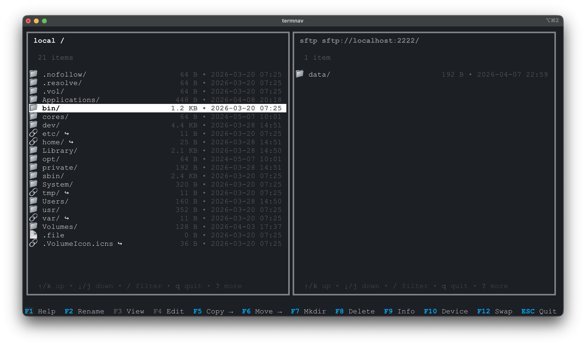

# 🗂️ TermNavigator



A dual‑pane terminal file navigator for **local filesystems** and **S3‑compatible storage**.

Navigate, view, edit, copy, move, delete, and inspect files across devices — all from a fast, keyboard‑driven TUI.

## 6. 🛠️ Installation

You can build and install TermNavigator directly from source.

### Build

```sh
make build
```

This compiles the project into the `dist/` directory for your platform.

### Install

```sh
make install
```

This installs the `termnav` binary into your system (`/usr/local/bin`), making it available globally.


## ✨ Features

- Dual‑pane navigation (like Midnight Commander)
- Local filesystem + S3‑compatible backends
- View, edit, copy, move, delete files
- Extract archives
- Metadata viewer
- Built‑in command mode (`:`)
- Shell integration
- Configurable devices
- Fake in‑memory filesystem for demos/tests


## 1. 🧭 Navigation

| Key | Action |
|-----|--------|
| ↑ / ↓ | Move selection |
| Enter | Open directory or file |
| Backspace | Go to parent directory |
| Tab | Switch active pane |


## 2. ⌨️ Function Keys

| Key | Action |
|-----|--------|
| F1 | Help |
| F2 | Rename selected item |
| F3 | View file |
| F4 | Edit file or extract archive |
| F5 | Copy item to opposite pane |
| F6 | Move item to opposite pane |
| F7 | Create directory |
| F8 | Delete selected item |
| F9 | Show metadata |
| F10 | Change device for active pane |
| F12 | Swap left/right devices |
| ESC | Quit |


## 3. 💽 Devices

Supported device types:

- **local** — Local filesystem  
- **s3** — AWS S3 or S3‑compatible (MinIO, Localstack, etc.)  
- **fakefs** — In‑memory virtual filesystem (testing, demos)

Device switching:

- **F10** — Change active pane’s device  
- **F12** — Swap left/right devices  


## 4. 🧪 Command Mode (press `:`)

```
help
    Show help screen.

rename <old> <new>
    Rename a file or folder.

view <file>
    View a file in read-only mode.

edit <file>
    Open a file in the default editor.

copy (cp) <src> <dest>
    Copy an item from the active pane to the opposite pane.

move (mv) <src> <dest>
    Move an item from the active pane to the opposite pane.

mkdir <name>
    Create a new directory.

delete (del) <name>
    Delete a file or directory.

info <file>
    Show metadata for a file or directory.

device (dev) <name>
    Switch the active device/pane to the specified backend.

swap
    Swap the left and right panes.

exit (quit, bye)
    Exit the application.

config (cfg)
    Open the configuration file in your default editor.

exec <command>
    Execute a shell command in the current directory (local backend only).

refresh
    Refresh both panes.

cd <folder>
    Change directory. Use ".." or the parent entry to go up.

shell
    Open your system shell in the current directory.

logs
    View logs.

batch <file>
    Runs a list of Termnav commands from a text file.

switch
    Switch to the other pane.
```


## 5. ⚙️ Configuration (`~/.termnav`)

Example:

```json
{
  "devices": [
    { "name": "local", "type": "local", "path": "/home/user" },
    {
      "name": "minio",
      "type": "s3",
      "bucket": ["mybucket"],
      "region": "us-east-1",
      "endpoint": "http://localhost:9000",
      "key": "minioadmin",
      "secret": "minioadmin"
    },
    {
      "name": "demo",
      "type": "fakefs"
    }
  ],
  "left": "local",
  "right": "demo"
}
```

### Device Properties

| Property | Description | Devices |
|----------|-------------|---------|
| name | Unique identifier | all |
| type | local / s3 / fakefs | all |
| path | Local filesystem path | local |
| bucket | S3 bucket name | s3 |
| region | AWS region (optional) | s3 |
| prefix | Prefix inside bucket | s3 |
| key | Static access key | s3 |
| secret | Static secret key | s3 |
| endpoint | Custom S3 endpoint | s3 |
| insecure | Skip TLS verification | s3 |
| ca_file | Custom CA bundle | s3 |
| expected_cert_name | Override certificate hostname | s3 |


#### 🎉 Happy navigating!
